# SyncPulse Swarm Control Plane Architecture

## Cost-Aware, Capability-Aware, Workspace-Scoped Multi-Agent Orchestration

**Status:** Architecture Proposal  
**Product:** SyncPulse  
**Control-plane integration:** Queen for licensing, entitlements, publishing, durable reporting, and commercial governance  
**Purpose:** Define a GitHub-ready operating model for coordinating specialized AI agents, tools, skills, workspaces, and models while minimizing cost, reducing conflicts, preserving authority, and continuously improving system capability.

---

## 1. Executive Summary

SyncPulse's Swarm MCP architecture is a hierarchical multi-agent coordination system designed to break complex projects into isolated, managed workspaces while maintaining centralized control over intent, task state, capability selection, quality gates, and model cost.

The system is built around a simple principle:

> **Use the least expensive capable model for each task, escalate only when required, and keep project truth centralized.**

Instead of allowing every model or agent to independently interpret a human request and act across the entire repository, the system separates responsibility into several layers:

1. **Intent and Coordination Layer** — interprets human input, decomposes goals, resolves dependencies, determines risk, and assigns authoritative task ownership.
2. **Workspace Layer** — isolates project management, design, architecture, coding, testing, review, remediation, release, and agent-governance work.
3. **Capability Layer** — tracks agent knowledge, tools, skills, models, versions, permissions, and performance.
4. **Capability Discovery Layer** — detects gaps and improvements, evaluates new resources, and safely acquires or upgrades them.
5. **Model Routing Layer** — chooses the least costly model likely to satisfy the task's quality and reasoning requirements.
6. **Verification Layer** — evaluates outputs, escalates failures, and determines whether work can advance to the next state.

The result is not simply a collection of agents. It is a **versioned, self-improving operating system for coordinated AI work**.

---

## 2. Design Goals

The architecture SHOULD optimize for the following goals:

- Reduce unnecessary use of expensive reasoning models.
- Avoid multiple agents modifying the same project surface simultaneously.
- Preserve a single authoritative source of project state.
- Route tasks according to capability, cost, risk, and historical performance.
- Allow specialist agents to operate with narrow write permissions and broad read access.
- Automatically identify missing or outdated capabilities.
- Safely procure and validate improved tools, skills, MCP servers, or other resources.
- Continuously improve agent instructions and knowledge based on real project outcomes.
- Escalate difficult tasks to stronger models only when cheaper models cannot reliably complete them.
- Preserve traceability for every task, model, tool, skill, agent, branch, decision, and result.

---


## SyncPulse Product Context

This architecture is the **execution intelligence layer of SyncPulse**, not a separate product.

SyncPulse is the local-first runtime and orchestration experience where operators launch agents, run workflows, consume packages, and coordinate work. This swarm control plane extends that role by making execution **intent-aware, workspace-scoped, capability-aware, model-cost-aware, and continuously improvable**.

Queen remains a separate trusted ecosystem control plane. SyncPulse owns local execution and orchestration; Queen owns licensing, entitlements, trusted package publishing/distribution, durable reporting, and commercial governance.

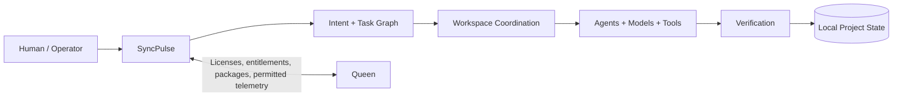

### SyncPulse SHOULD own

- human intent interpretation and task decomposition;
- project/workspace coordination;
- agent runtime and scoped permissions;
- least-cost qualified model routing;
- local tool and skill execution;
- verification and escalation;
- local capability inventory and performance observations;
- agent/workspace instructions;
- discovery of capability upgrade opportunities.

### Queen SHOULD own

- license issuance and validation;
- commercial-use rights and paid entitlements;
- trusted package publishing and authorized distribution;
- publisher governance;
- durable organization/account records;
- permitted ecosystem telemetry and reporting;
- billing/subscription integration;
- durable commercial/audit records.

> **Boundary rule:** SyncPulse executes. Queen governs ecosystem trust.

---

## 3. Core Principle

The system separates **authority**, **execution**, and **verification**.

```text
Human Intent
    ↓
Authoritative Intent Engine
    ↓
Task Graph + Policy + Budget
    ↓
Workspace / Agent / Model Selection
    ↓
Execution
    ↓
Verification
    ↓
Accept / Remediate / Escalate
```

The most capable model is not automatically the default model.

The default should instead be:

> **the lowest-cost model that satisfies the predicted requirements of the task with acceptable confidence.**

More expensive reasoning should be treated as an escalation resource.

---

## 4. System Architecture

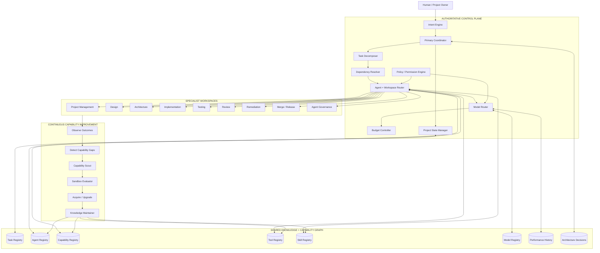

---

## 5. The Intent Engine

The Intent Engine is the first authoritative reasoning boundary between human input and system execution.

Its purpose is to determine **what the human actually wants**, not merely what words were entered.

The Intent Engine is authoritative for normalization and routing, but it SHOULD NOT silently decide ambiguous product intent, destructive actions, security-sensitive policy, material architecture changes, or decisions where confidence is below policy threshold. Those conditions create a **Human Decision Gate**.

It SHOULD identify:

- project or workspace scope;
- desired outcome;
- explicit requirements;
- implied requirements;
- constraints;
- risk level;
- urgency;
- dependencies;
- expected artifact type;
- required capabilities;
- acceptable quality threshold;
- expected reasoning complexity;
- whether the work can be safely decomposed;
- whether independent tasks may run in parallel;
- whether human approval is required;
- expected token / compute budget.

### Intent normalization

Human input:

```text
"Fix login and make sure we don't break OAuth. Review the PR before merging."
```

Normalized intent:

```yaml
intent:
  project: application
  objective: repair authentication defect
  constraints:
    - preserve_oauth_behavior
    - require_review
    - require_tests
    - no_direct_main_merge
  workspaces:
    - implementation
    - testing
    - review
    - merge
  risk: high
  reasoning_complexity: medium
```

The normalized intent becomes the authoritative input to task decomposition and routing.

---


### Human Decision Gates

The coordinator SHOULD request human judgment when:

- two materially different interpretations remain plausible;
- a decision changes product scope or public behavior;
- an action is destructive or difficult to reverse;
- secrets, billing, deployment authority, or production access are involved;
- a capability requests materially broader permissions;
- an upgrade introduces a breaking change;
- reviewers disagree and policy cannot resolve the conflict;
- expected spend exceeds an authorized budget;
- confidence falls below the configured threshold.

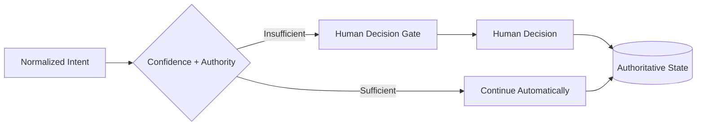

The desired behavior is **autonomy by default, human judgment by exception**.

---

## 6. Centralized Authority

The architecture SHOULD use one primary coordinator or a small consensus group of coordination models.

Specialist workers SHOULD NOT independently redefine global project intent.

The coordinator owns:

- project state;
- task decomposition;
- priority;
- dependency resolution;
- routing;
- escalation;
- acceptance gates;
- budget allocation;
- branch authorization;
- model selection policy;
- capability procurement policy.

Worker agents own only their assigned execution scope.

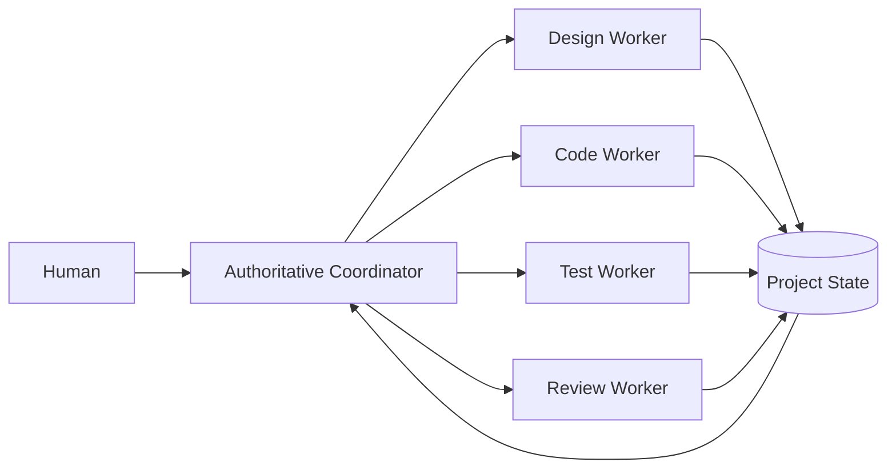

This prevents agent-to-agent conversational drift from becoming project truth.

---

## 7. Workspace Isolation

Each major responsibility SHOULD have a distinct workspace.

Recommended workspaces:

```text
/project
/design
/architecture
/src
/tests
/review
/remediation
/release
/.agents
```

Each workspace SHOULD have:

- scoped instructions;
- allowed task types;
- allowed tools;
- allowed models;
- read permissions;
- write permissions;
- completion criteria;
- escalation rules.

### Primary rule

> **Read broadly. Write narrowly.**

Examples:

- Review agents may inspect source code but SHOULD NOT implement fixes.
- Test agents may inspect implementation code but SHOULD primarily write tests and test artifacts.
- Design agents SHOULD NOT directly modify production code unless explicitly authorized.
- Merge agents SHOULD NOT reinterpret feature requirements.
- Implementation agents SHOULD NOT approve their own changes.

---

## 8. Agent Knowledge as Versioned Operational State

Agent knowledge SHOULD be treated as a first-class, versioned system asset.

Recommended structure:

```text
.agents/
├── registry.yaml
├── coordinator/
│   ├── AGENT.md
│   ├── capabilities.yaml
│   ├── tools.yaml
│   ├── skills.yaml
│   ├── tasks.yaml
│   ├── permissions.yaml
│   └── lessons.md
├── developer/
│   └── ...
├── tester/
│   └── ...
├── reviewer/
│   └── ...
└── release/
    └── ...
```

`AGENT.md` explains behavior to humans and models.

Structured manifests provide machine-readable truth.

Example:

```yaml
agent:
  id: typescript-developer
  version: 3.2.1
  workspace: implementation

capabilities:
  - typescript.backend
  - react.frontend
  - postgres.schema

skills:
  - typescript-production@4.0.2
  - postgres-migrations@2.1.0

tools:
  - github-mcp
  - filesystem

permissions:
  read:
    - project
    - design
    - architecture
    - src
    - tests
  write:
    - src
    - tests/unit

restrictions:
  - cannot_merge_main
  - cannot_approve_own_pr
  - cannot_modify_global_policy
```

---

## 9. Capability Graph

The system SHOULD model agents, tasks, tools, skills, models, resources, and results as a graph rather than disconnected configuration files.

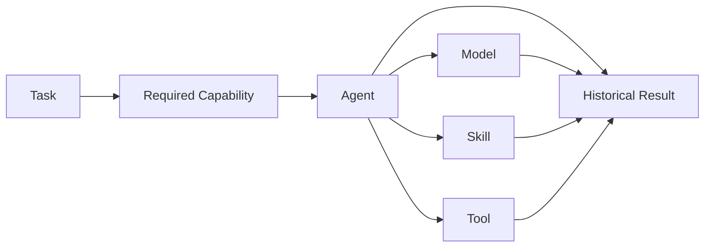

This allows the router to answer:

> Which available combination of agent, model, skill, and tool has the best expected outcome for this task at the lowest acceptable cost?

---

## 10. Cost-Aware Model Routing

Model routing is a central part of the architecture.

Different tasks require different levels of intelligence, context, tool use, and reasoning depth.

A formatting task should not automatically receive the same model as a difficult architecture review.

### Model selection objective

For each task, the Model Router SHOULD minimize:

```text
Expected Cost
```

subject to:

```text
Expected Quality >= Required Quality
Expected Reliability >= Required Reliability
Required Capabilities ⊆ Model Capabilities
Risk Policy = Satisfied
Context Requirement <= Supported Context
Tool Requirement = Supported
```

Conceptually:

```text
Choose model m that minimizes Cost(m, task)

such that:

P(success | m, task) >= threshold(task)
```

---

## 11. Model Tiers

The system SHOULD classify available models into capability and cost tiers.

Example:

| Tier | Role | Typical Use |
|---|---|---|
| T0 | deterministic / non-model | parsing, schema validation, simple transforms |
| T1 | low-cost model | classification, summaries, simple edits, routine code |
| T2 | standard model | normal implementation, testing, documentation |
| T3 | advanced reasoning | architecture, difficult debugging, ambiguous requirements |
| T4 | premium reasoning | high-risk decisions, complex cross-system analysis, escalation |

The actual models assigned to these tiers MAY change over time.

The architecture depends on **capability classes**, not specific vendor names.

---

## 12. Model Routing Pipeline

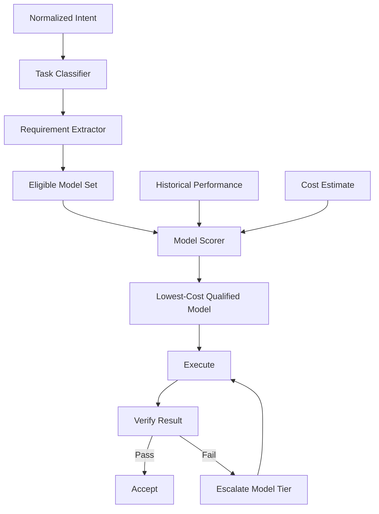

---

## 13. Routing Score

A model candidate MAY be evaluated using a weighted score.

Example:

```text
score =
    capability_fit
  + historical_success
  + task_similarity
  + latency_fit
  + context_fit
  - normalized_cost
  - failure_risk
```

A more formal implementation could use:

```text
Utility(m,t) =
    α * CapabilityFit(m,t)
  + β * HistoricalSuccess(m,t)
  + γ * Quality(m,t)
  + δ * LatencyFit(m,t)
  - λ * Cost(m,t)
  - ρ * Risk(m,t)
```

The router chooses the cheapest model meeting the required minimum utility and confidence threshold.

---

## 14. Escalation Instead of Premium-by-Default

Expensive models SHOULD generally be reached through escalation.

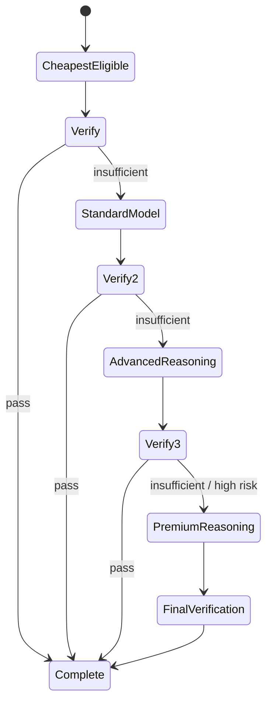

Reasons to escalate MAY include:

- verification failure;
- repeated test failure;
- contradictory outputs;
- low confidence;
- unresolved ambiguity;
- security-sensitive reasoning;
- architectural scope;
- multi-system dependency analysis;
- failed cheaper-model attempts;
- policy requirement.

---

## 15. Avoiding False Economy

The cheapest individual model call is not always the cheapest workflow.

For example:

```text
Cheap model × 8 failed attempts > Advanced model × 1 successful attempt
```

The system SHOULD therefore optimize **expected total task cost**, not simply per-call price.

```text
ExpectedTaskCost =
  InitialExecutionCost
  + ExpectedRetryCost
  + VerificationCost
  + ExpectedRemediationCost
  + ExpectedEscalationCost
```

Historical performance allows this estimate to improve over time.

---

## 16. Routing by Task Type

A routing policy MAY initially use heuristics.

Example:

```yaml
routing:
  classify_intent:
    preferred_tier: T1

  generate_unit_tests:
    preferred_tier: T1
    escalate_after_failures: 1

  implement_standard_feature:
    preferred_tier: T2

  review_pull_request:
    preferred_tier: T2

  architecture_decision:
    preferred_tier: T3

  security_critical_review:
    preferred_tier: T3
    independent_verification: true

  resolve_cross_system_failure:
    preferred_tier: T3
    escalate_after_failures: 1

  modify_global_agent_policy:
    preferred_tier: T4
    human_approval: true
```

Over time, performance data SHOULD replace coarse heuristics with evidence-driven routing.

---

## 17. Decomposition Reduces Model Cost

A central reason for decomposing work is that a difficult project does not mean every subtask is difficult.

Example:

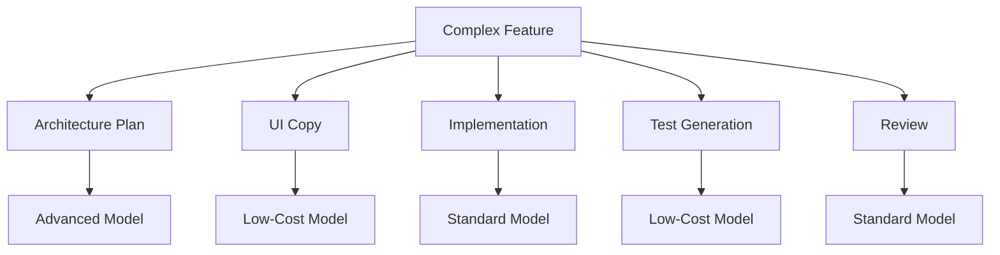

Without decomposition, the entire feature may be sent to an advanced model.

With decomposition, premium reasoning is reserved only for the components that require it.

---

## 18. Verification Is What Makes Cheap Routing Safe

Cost-aware routing only works if output quality is independently measured.

The system SHOULD prefer verifiable tasks for lower-cost models.

Examples of automated verification:

- compiler passes;
- type checker passes;
- unit tests pass;
- integration tests pass;
- schema validates;
- lint passes;
- expected files exist;
- API contract is preserved;
- screenshots match constraints;
- reviewer approves;
- security scanner passes.

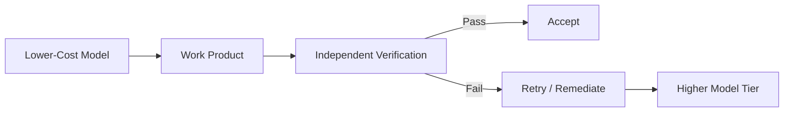

The better the verification system becomes, the more safely the swarm can delegate work to cheaper models.

---

## 19. Capability Discovery and Automatic Procurement

The Swarm SHOULD continuously inspect its own capability graph for missing or outdated resources.

Signals include:

- repeated task failures;
- new task types;
- unavailable capability;
- poor agent performance;
- newly released tool versions;
- improved skills;
- new MCP resources;
- deprecated dependencies;
- reviewer recommendations.

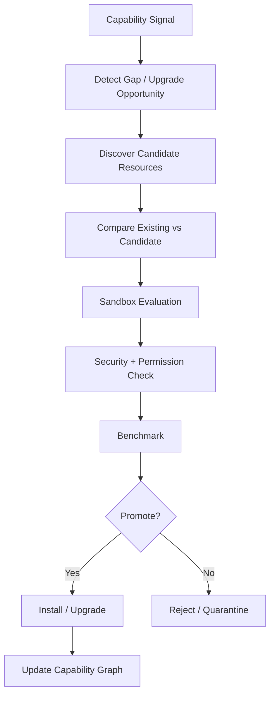

---

## 20. Procurement Risk Tiers

Automatic acquisition SHOULD be permission-aware.

| Tier | Resource | Policy |
|---|---|---|
| P0 | documentation / metadata | auto-update |
| P1 | read-only skill or tool | sandbox, then automatic promotion |
| P2 | repository-writing capability | coordinator authorization |
| P3 | deployment, secrets, billing, credentials | explicit human authorization |

Any capability that can broaden its own permissions, modify global routing policy, or procure additional privileged capabilities SHOULD also be treated as P3.

The system SHOULD never equate "newer" with "better."

Promotion requires evidence. Discovered resources SHOULD first become candidates with recorded provenance, source, version, requested permissions, compatibility, integrity information where available, benchmark results, replacement target, and rollback path. Anything that cannot be safely evaluated remains quarantined.

---

## 21. Agent Self-Improvement

Repeated outcomes SHOULD improve agent knowledge.

Example:

```text
Reviewer repeatedly detects missing database migrations
        ↓
Pattern detector identifies recurring failure
        ↓
Knowledge Maintainer proposes agent rule
        ↓
Rule is tested / reviewed
        ↓
developer/AGENT.md updated
        ↓
Agent version bumped
```

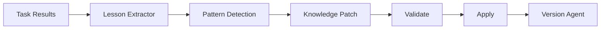

---

## 22. Independent Versioning

The architecture SHOULD independently version:

- project;
- agents;
- skills;
- tools;
- model-routing policy;
- capability registry;
- architecture decisions.

Example task provenance:

```yaml
task: TASK-284

intent_version: 1.3.0
routing_policy: 2.1.0

executed_by:
  agent: typescript-developer
  agent_version: 3.2.1

model:
  tier: T2
  model_id: standard-code-model

skills:
  - typescript-production@4.0.2
  - postgres-migrations@2.1.0

tools:
  - github-mcp@2.6.0

verification:
  tests: passed
  lint: passed
  review: approved

result:
  status: merged
  attempts: 1
  cost_units: 14.2
```

This makes model-selection decisions auditable.

---

## 23. Historical Performance Feedback

Every completed task SHOULD contribute to routing intelligence.

Useful metrics include:

- first-pass success rate;
- verification pass rate;
- review acceptance rate;
- average retries;
- average task cost;
- token consumption;
- latency;
- defect escape rate;
- regression rate;
- human intervention rate;
- task-type performance;
- agent-model pairing performance.

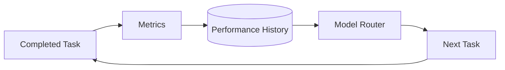

The router therefore becomes progressively less heuristic and more empirical.

---


## Cost Governance and Budget Envelopes

The router SHOULD optimize total expected task cost while respecting explicit financial boundaries.

Budgets MAY exist at organization, project, epic, and task levels:

```yaml
budget:
  project:
    monthly_limit: 250
  task:
    soft_limit: 2
    hard_limit: 5
```

A soft limit SHOULD trigger reconsideration of decomposition, caching, deterministic tooling, or cheaper eligible models. A hard limit SHOULD stop additional escalation unless policy already authorizes the overage or a human approves it.

The coordinator SHOULD avoid paying a model for deterministic work. Parsing, schema validation, hashing, formatting, dependency checks, test execution, Git operations, and similar operations SHOULD default to tools when practical.

```text
Deterministic tool
    ↓ if reasoning is required
Lowest-cost qualified model
    ↓ if verification fails
Higher-capability model
    ↓ if authority/confidence is insufficient
Human decision gate
```

---

## 24. Task Lifecycle

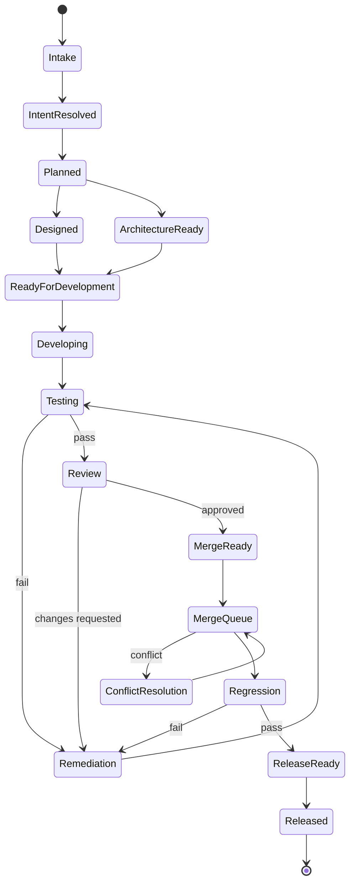

Model selection can occur independently at each state.

The model that designs a feature does not have to be the model that implements, tests, reviews, or fixes it.

---

## 25. Branch Strategy

Branches SHOULD belong to work, not agents.

Preferred:

```text
feat/TASK-184-auth
fix/TASK-184-review
chore/TASK-201-agent-policy
```

Avoid:

```text
claude-work
codex-work
agent-7
reviewer-2
```

Task ownership remains stable even when the executing model changes.

---

## 26. Separation of Agent and Model

An **agent** and a **model** are different concepts.

An agent is a versioned operational identity containing:

- role;
- instructions;
- capabilities;
- tools;
- skills;
- permissions;
- workspace;
- task history.

A model is one execution engine available to that agent.

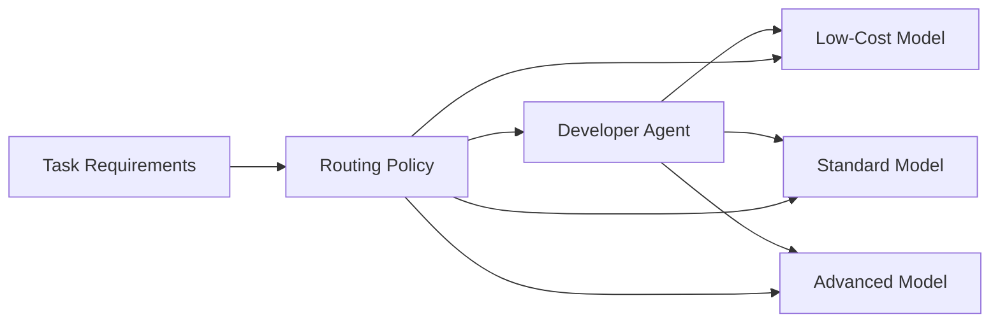

This allows one agent identity to dynamically use different models while preserving the same instructions, permissions, workspace, and responsibility.

---

## 27. Why Centralized Model Selection Matters

If each worker chooses its own model independently, several problems emerge:

- workers may consistently over-select expensive models;
- workers lack global budget awareness;
- workers cannot fairly compare their performance against alternatives;
- model escalation becomes inconsistent;
- expensive models may be used for trivial work;
- no authoritative cost policy exists.

Central routing provides a global optimization layer.

The coordinator can reason across:

```text
Task Requirements
+ Available Models
+ Current Budget
+ Historical Performance
+ Agent Capabilities
+ Tool Availability
+ Risk
+ Latency
+ Verification Strength
= Routing Decision
```

---

## 28. Multi-Coordinator Option

For large projects, authority MAY be distributed across a small coordination group.

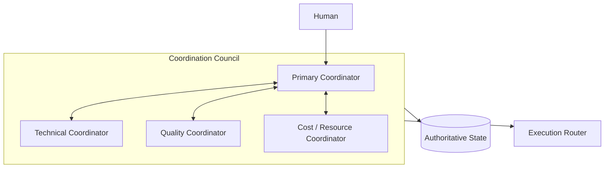

However, the system SHOULD still expose one authoritative state transition mechanism.

Multiple coordinators must not create multiple conflicting realities.

---

## 29. Recommended Decision Order

For each new human request:

```text
1. Interpret intent.
2. Resolve project and workspace scope.
3. Determine risk and approval requirements.
4. Decompose into task graph.
5. Identify required capabilities.
6. Select eligible agent(s).
7. Select eligible tools and skills.
8. Determine quality threshold.
9. Find the cheapest model predicted to satisfy the threshold.
10. Execute.
11. Verify independently.
12. Accept, remediate, or escalate.
13. Record performance.
14. Update knowledge if a new lesson was learned.
15. Search for capability improvement if a gap was identified.
```

---

## 30. End-to-End Example

Human request:

```text
"Add magic-link authentication, make the UI match the design system,
test it, review the implementation, and merge it if everything passes."
```

The Intent Engine produces:

```text
EPIC: Authentication

TASK-101 Architecture
TASK-102 UI Design Alignment
TASK-103 Backend Implementation
TASK-104 Frontend Implementation
TASK-105 Unit Tests
TASK-106 Integration Tests
TASK-107 Security Review
TASK-108 Code Review
TASK-109 Remediation
TASK-110 Merge
```

Model routing might assign:

```text
TASK-101 → T3 advanced reasoning
TASK-102 → T2 standard model
TASK-103 → T2 standard model
TASK-104 → T2 standard model
TASK-105 → T1 low-cost model
TASK-106 → T2 standard model
TASK-107 → T3 advanced reasoning
TASK-108 → T2 standard model
TASK-109 → cheapest tier capable of each finding
TASK-110 → deterministic automation + policy checks
```

The system avoids spending premium-model compute on test scaffolding, branch operations, formatting, routine code generation, or deterministic checks.

---

## 31. Economic Principle

The architecture is designed around **selective intelligence**.

AI reasoning should be treated as a resource with different costs and capabilities.

The swarm should spend intelligence where intelligence creates value.

```text
Do not ask:
"What is the best model available?"

Ask:
"What is the least expensive model that can reliably complete this specific task?"
```

Then verify the result.

If the answer is insufficient, escalate.

---

## 32. Final Architecture

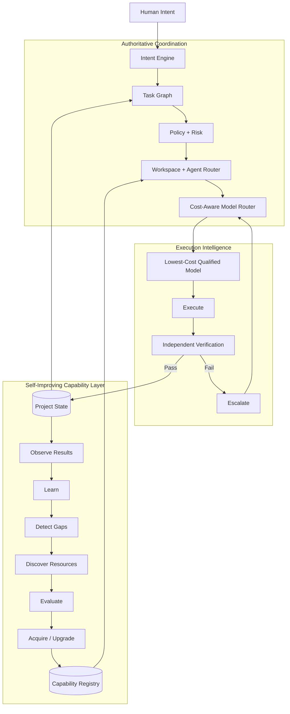

---

## 33. Architectural Summary

The Swarm MCP should behave like an organization, not a group chat.

Its operating principles are:

1. **Human intent enters through an authoritative intent engine.**
2. **The coordinator owns project truth and task state.**
3. **Projects are decomposed into narrow, workspace-scoped tasks.**
4. **Agents are persistent, versioned operational identities.**
5. **Models are interchangeable execution resources assigned to agents.**
6. **The cheapest qualified model should be selected first.**
7. **Verification determines whether cheap execution was sufficient.**
8. **Failure causes remediation or model escalation, not uncontrolled repetition.**
9. **Historical performance improves future routing decisions.**
10. **Capabilities, skills, tools, and agent instructions continuously evolve.**
11. **New capabilities are sandboxed and risk-classified before promotion.**
12. **Branches belong to tasks, not models or agents.**
13. **Read access is broad; write authority is narrow.**
14. **High-cost reasoning is reserved for the work that actually requires it.**
15. **Every decision remains auditable through task provenance and version history.**

The result is a cost-conscious, capability-aware, continuously improving multi-agent system capable of scaling from a single repository to a coordinated portfolio of projects without allowing model cost, context drift, or agent conflict to grow uncontrollably.

---


## SyncPulse Operating Thesis

SyncPulse should behave less like a collection of chat agents and more like a **local-first AI operations control plane**.

Its differentiation is the combination of authoritative intent normalization, isolated workspaces, persistent agent identities, interchangeable model execution, least-cost qualified routing, deterministic verification, capability discovery, explicit human decision gates, and auditable task provenance.

Queen complements this architecture wherever trust must extend beyond one local runtime.

---

## Recommended Implementation Sequence

1. Authoritative task registry and state machine.
2. Workspace manifests and narrow write permissions.
3. Versioned agent registry and machine-readable manifests.
4. Intent normalization and task decomposition.
5. Static model tiers and deterministic verification.
6. Budget envelopes and escalation policy.
7. Historical performance collection.
8. Evidence-driven model routing.
9. Capability registry and gap detection.
10. Sandboxed capability discovery/procurement.
11. Queen integration for trusted package, entitlement, and commercial functions.
12. Human decision-gate UI and policy controls.

Self-improvement and automatic procurement should not block the first reliable orchestrator. State, permissions, provenance, and verification should become trustworthy first.

---

## Open Human Decision Gates

These choices materially affect implementation and should remain explicit:

1. **Coordinator topology** — one authoritative coordinator, or a small council with one state-transition authority?
2. **Procurement posture** — may P1 read-only capabilities auto-promote after sandbox success, or should every new executable third-party capability require approval?
3. **Budget authority** — what spend threshold may SyncPulse authorize without asking?
4. **Queen telemetry boundary** — only ecosystem/commercial telemetry, or also cross-install routing-performance data for improving defaults?
5. **Agent knowledge changes** — may low-risk instruction lessons auto-merge after validation, or should all `AGENT.md` changes require review?
6. **Model privacy policy** — may any eligible external model receive project context, or should workspaces declare allowed provider/model classes?

---

## Guiding Statement

> **Centralize intent. Decompose work. Isolate execution. Route by capability. Spend reasoning selectively. Verify everything. Learn continuously. Ask humans when authority—not compute—is the missing resource.**
